## 🔐 Authentification

Trois méthodes de connexion disponibles :

---

### 📧 Connexion par Email
Un code OTP à 6 chiffres est envoyé dans votre boîte mail pour valider la connexion.

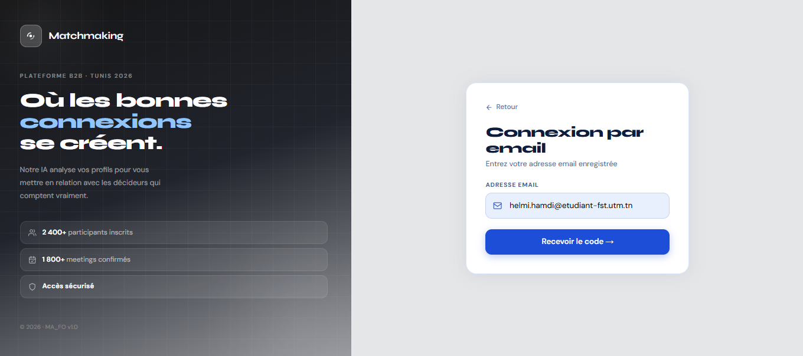
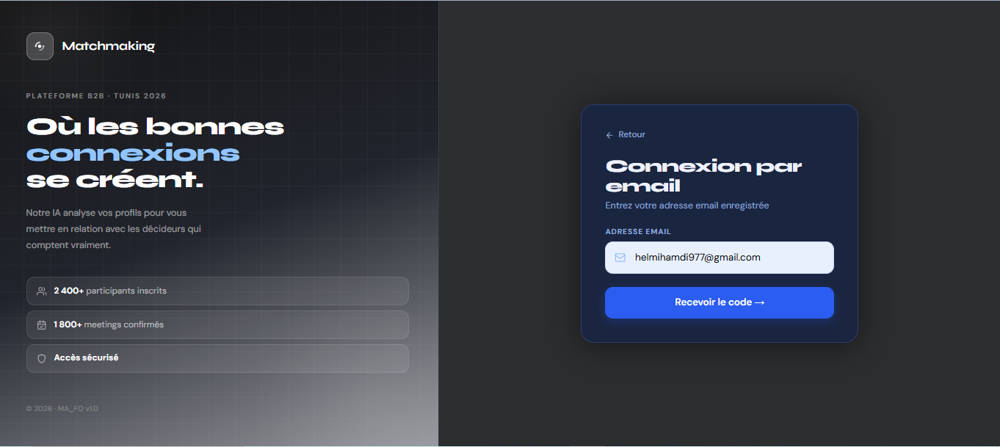

---

### 📱 Connexion par Téléphone (SMS)
Un code de vérification est envoyé par SMS sur votre numéro de téléphone.

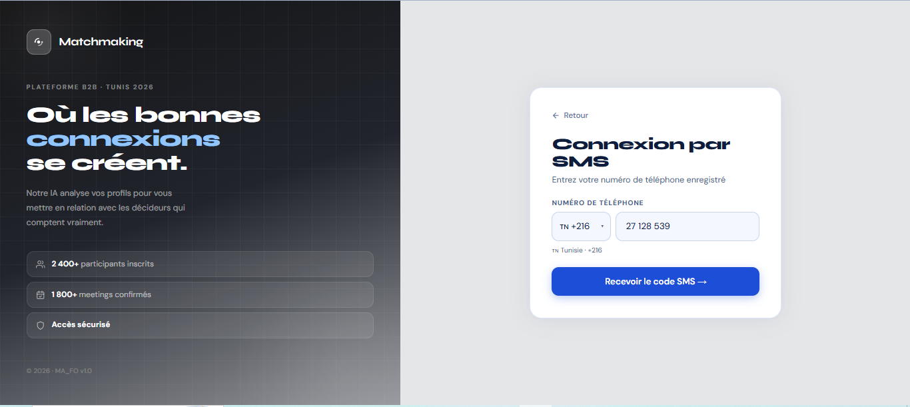

---

### 📷 Connexion par QR Code
Scannez le QR Code généré pour une connexion rapide et sans saisie.

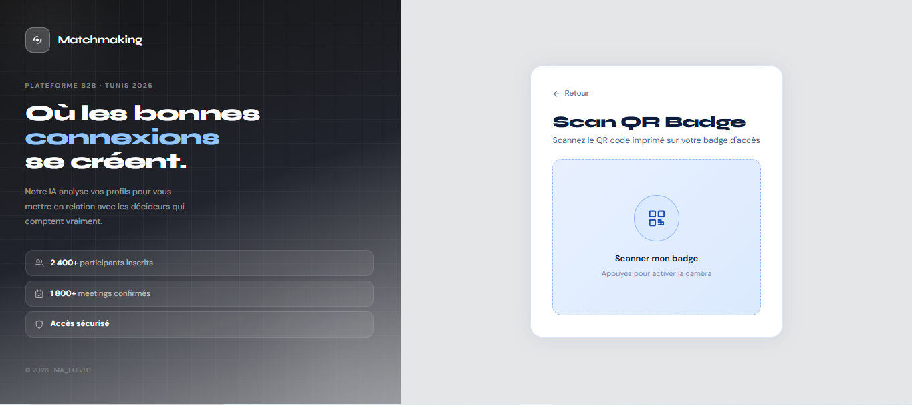

---

### 🖥️ Page de Login

## 🔍 Discovery Module

Le cœur du matching de l'application. Trouvez vos connexions idéales grâce à deux modes de découverte :

- 🔄 **Mode Swipe** — Des lots de 10 profils curatés par l'IA, style Tinder.
- 📋 **Mode View All** — Répertoire complet avec filtre classique et filtre intelligent IA.

> Les deux modes mènent à des **connexions** entre utilisateurs.

---

### 🖥️ Version Web
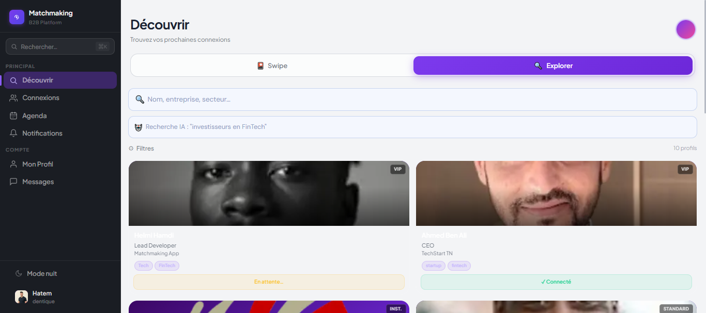
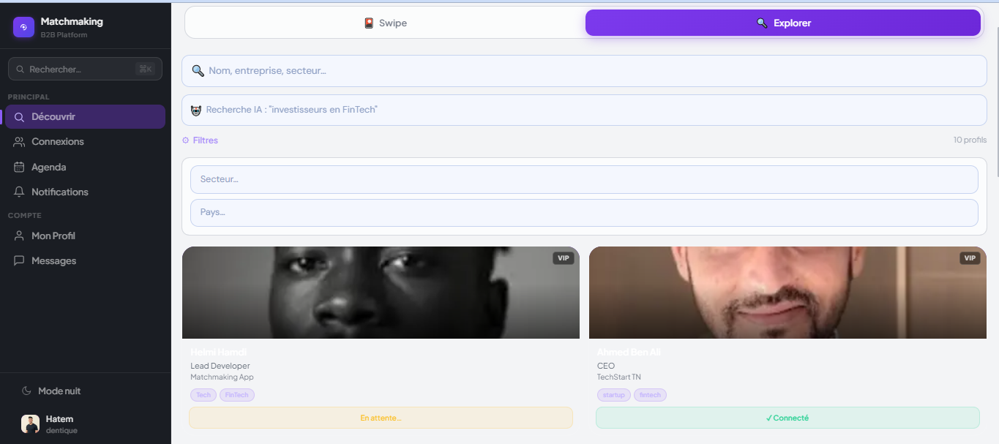
---

### 📱 Version Mobile
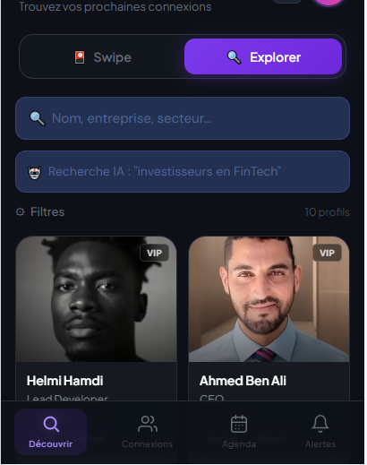
# 📸 Screenshots — B2B Matchmaking Platform

Documentation visuelle de l'application **B2B Matchmaking** — captures organisées par module selon les spécifications fonctionnelles.

---

## 🗺️ Tableau des fichiers

| Fichier | Module | Écran |
|---|---|---|
| `agenda.png` | 5.3 — Mon Agenda | Vue principale — mode clair (Hatem) |
| `agenda1.png` | 5.3 — Mon Agenda | Carte réunion étendue avec actions — mode sombre (Fatma) |
| `chat2.png` | 5.2 — In-Chat Card | Carte demande de réunion reçue (vue Fatma) |
| `chate.png` | 5.2 — In-Chat Card | Carte réunion replanifiée (vue Hatem) |
| `connection.png` | 4 — Connexions | Liste des connexions |
| `connection2.png` | 4 — Connexions | Profil d'une connexion (Ahmed Ben Ali) |
| `demande2.png` | 5.1 — Meeting Request | Step 2 — Personnaliser le message IA |
| `demander1.png` | 5.1 — Meeting Request | Step 1 — Choisir un créneau disponible |
| `scan_meeting.png` | 5.5 — QR Confirmation | Modal invitation à scanner |
| `scanmettings2.png` | 5.5 — QR Confirmation | Caméra active — scan en cours |
| `meetings1.png` | 5.3 — Reporter | Sélection du nouveau créneau |
| `meetings2.png` | 5.3 — Reporter | Confirmation du report |
| `chat_helmi.png` | 6.1 — Chat Thread | Thread avec réunion terminée + messages |
| `notifications-desktop.png` | 7.1 — Notifications | Centre de notifications — desktop |
| `notifications-mobile.png` | 7.1 — Notifications | Centre de notifications — mobile |

---

## 📅 Module 4 — Connexions

### `connection.png` — Liste des connexions
Vue **Mes Connexions** — liste de toutes les connexions confirmées avec statut de réunion.

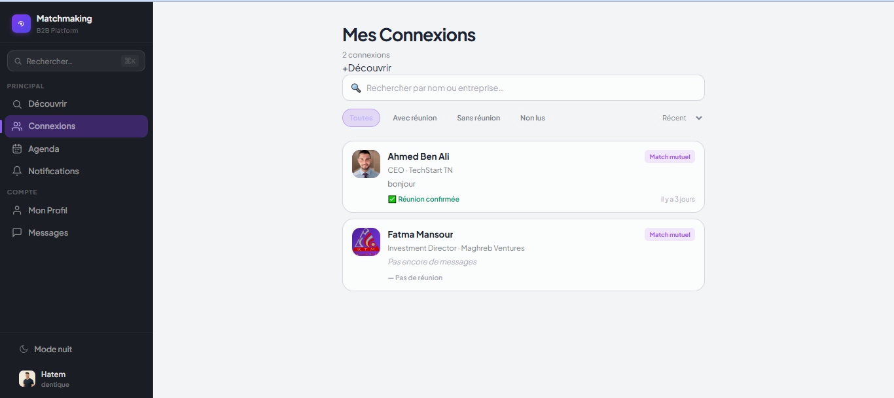

- Filtres : Toutes · Avec réunion · Sans réunion · Non lus
- Badge **Match mutuel** sur chaque connexion
- Indicateur de statut (✅ Réunion confirmée / — Pas de réunion)

---

### `connection2.png` — Profil d'une connexion
Vue détaillée du profil d'un participant connecté (Ahmed Ben Ali, CEO · TechStart TN).

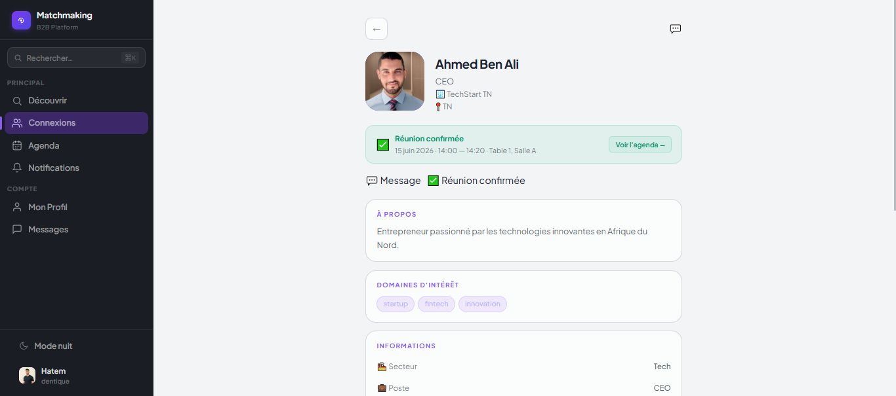

- Photo, nom, poste, entreprise, pays
- Bandeau réunion confirmée avec lien vers l'agenda
- Sections : À propos · Domaines d'intérêt · Informations

---

## 📅 Module 5 — Réunions B2B

### `demander1.png` — Step 1 : Choisir un créneau
Sélection du créneau disponible pour la demande de réunion avec Fatma Mansour.

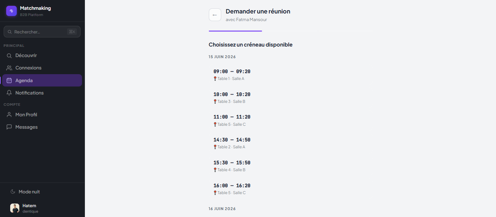

- Créneaux de 20 minutes affichés par jour d'événement
- Table et salle assignées automatiquement à chaque créneau
- Seuls les créneaux mutuellement disponibles sont affichés

---

### `demande2.png` — Step 2 : Personnaliser le message
Rédaction du message accompagnant la demande de réunion.

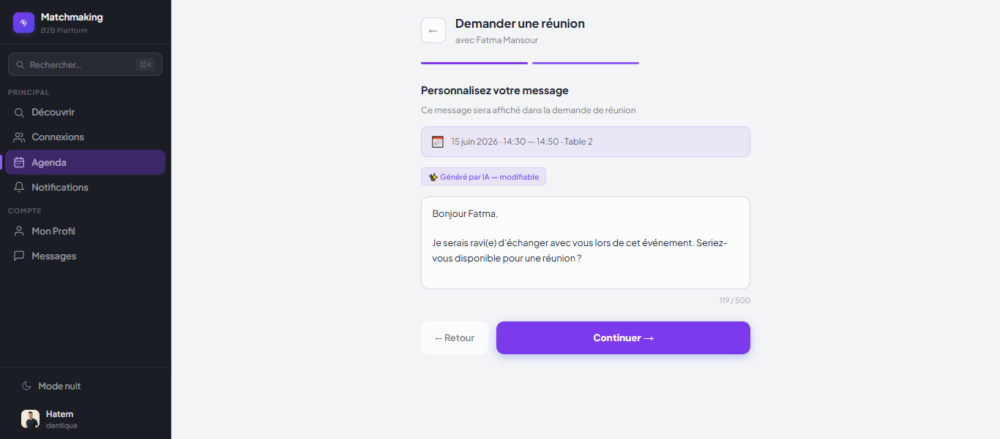

- Récapitulatif du créneau sélectionné
- Message pré-rempli **généré par IA** (GPT-4o), modifiable inline
- Compteur de caractères (max 500)

---

### `chat2.png` — Carte demande de réunion (vue destinataire)
Carte de demande de réunion reçue dans le thread — vue de Fatma Mansour.

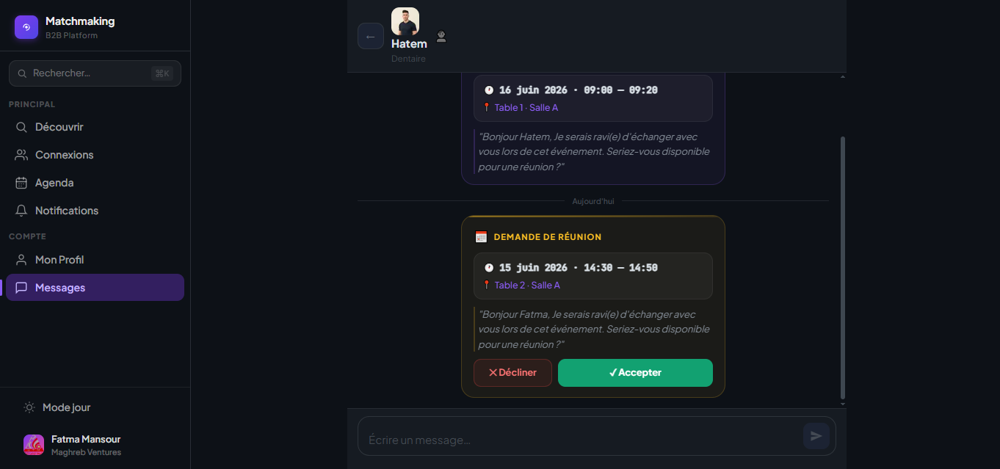

- En-tête : **DEMANDE DE RÉUNION** 📅
- Date, heure, table, salle
- Message personnalisé de l'expéditeur
- Boutons : ✕ Décliner · ✓ Accepter

---

### `chate.png` — Carte réunion replanifiée (vue expéditeur)
Thread affichant une carte **RÉUNION REPLANIFIÉE** — vue de Hatem.

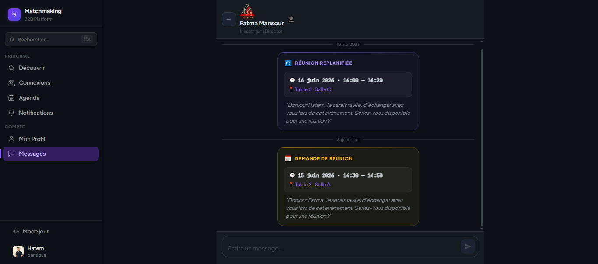

- Ancienne carte visible en haut du thread
- Nouvelle carte avec nouveaux créneaux affichée en dessous
- Carte immutable après action

---

### `agenda.png` — Mon Agenda (mode clair)
Tableau de bord de l'agenda personnel — vue de Hatem.

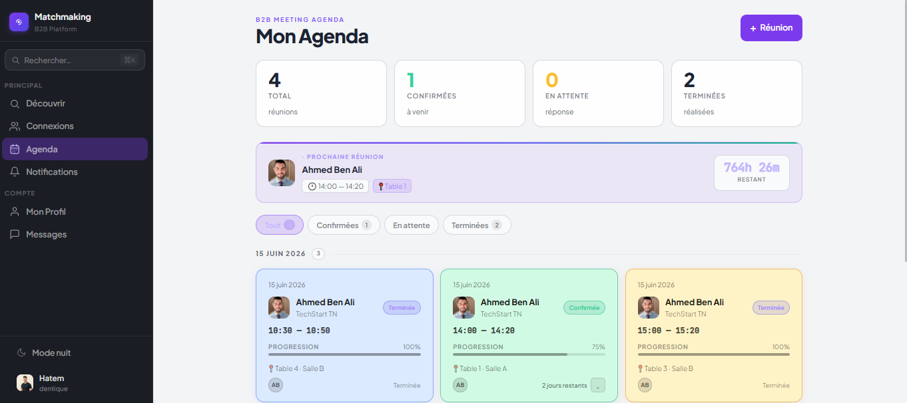

- 4 compteurs : Total · Confirmées · En attente · Terminées
- Bandeau **Prochaine réunion** avec compte à rebours
- Filtres : Tout · Confirmées · En attente · Terminées
- Réunions regroupées par jour avec statut coloré

---

### `agenda1.png` — Mon Agenda avec actions (mode sombre)
Vue agenda de Fatma Mansour avec une carte de réunion confirmée déployée.

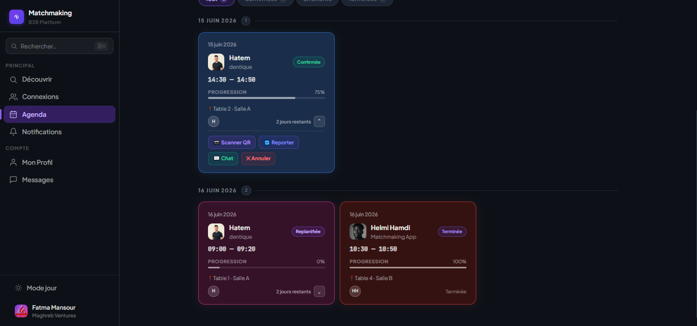

- Actions disponibles : 📷 Scanner QR · 🔄 Reporter · 💬 Chat · ✕ Annuler
- Statuts : Confirmée · Replanifiée · Terminée
- Barre de progression par réunion

---

### `meetings1.png` — Reporter : sélection du créneau
Modal de report — sélection d'un nouveau créneau disponible.

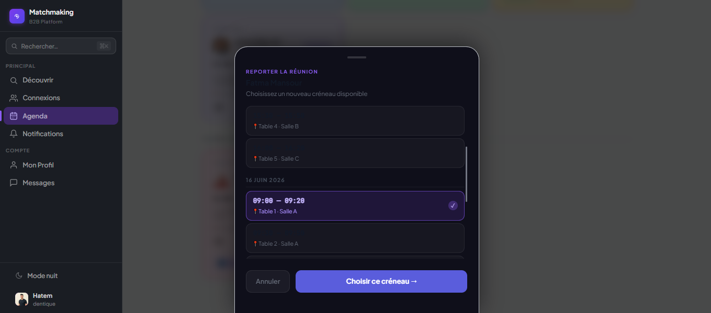

- Liste des créneaux mutuellement disponibles (table + salle)
- Créneau sélectionné mis en surbrillance
- Boutons : Annuler · Choisir ce créneau →

---

### `meetings2.png` — Reporter : confirmation
Modal de confirmation avant validation du report.

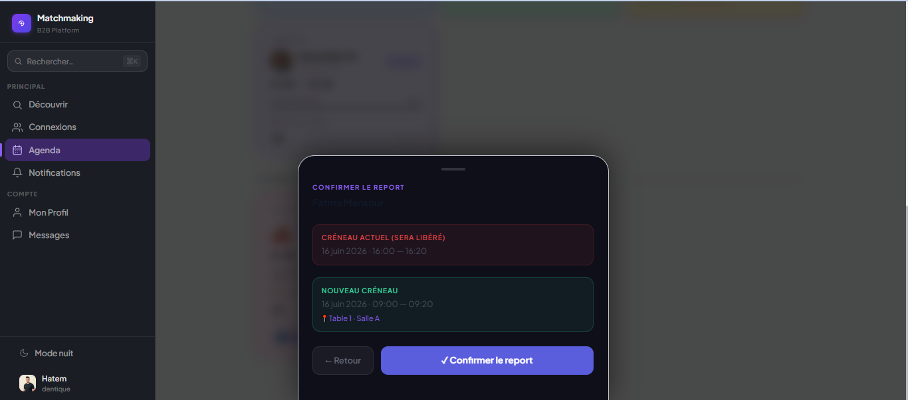

- **Créneau actuel** (sera libéré) affiché en rouge
- **Nouveau créneau** affiché en vert avec table et salle
- Boutons : ← Retour · ✓ Confirmer le report

---

### `scan_meeting.png` — QR : invitation à scanner
Modal "Confirmer la présence" avant l'ouverture de la caméra.

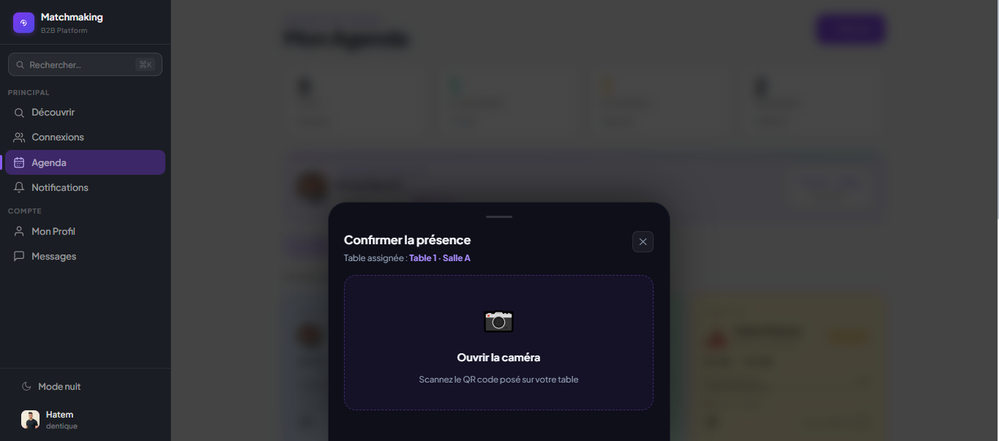

- Table assignée rappelée : **Table 1 · Salle A**
- Bouton **Ouvrir la caméra**
- Message : "Scannez le QR code posé sur votre table"

---

### `scanmettings2.png` — QR : caméra active
Caméra ouverte et prête à scanner le QR code de la table.

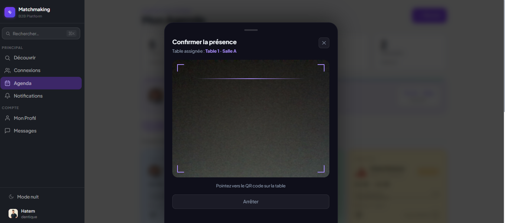

- Viewfinder actif avec cadre de scan
- Message : "Pointez vers le QR code sur la table"
- Bouton **Arrêter** pour annuler

---

## 💬 Module 6 — Chat

### `chat_helmi.png` — Thread avec réunion terminée
Conversation entre Helmi Hamdi et Fatma incluant une carte **RÉUNION TERMINÉE** et des messages texte.

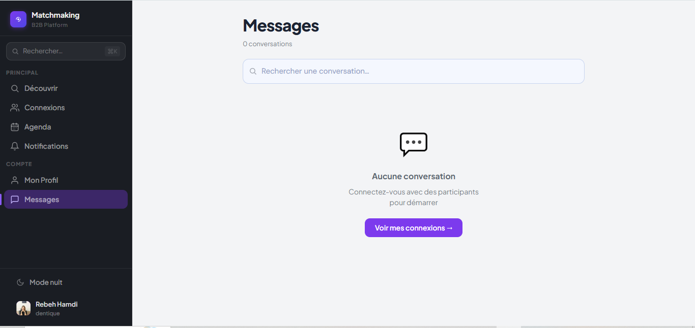

- Carte de réunion terminée en haut du thread
- Messages texte avec bulles et read receipts (double coche)
- Champ de saisie en bas

---

## 🔔 Module 7 — Notifications

### `notifications-desktop.png` — Notifications (desktop)
Centre de notifications avec filtres par catégorie — vue desktop.

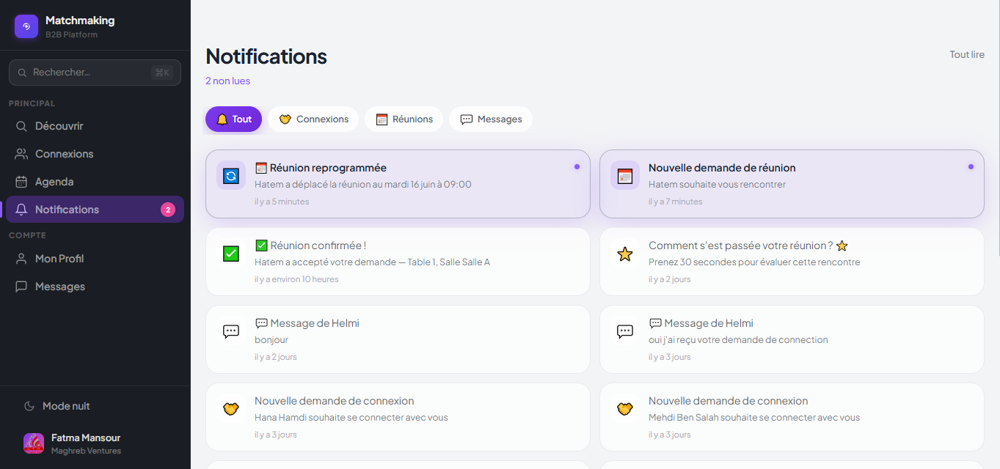
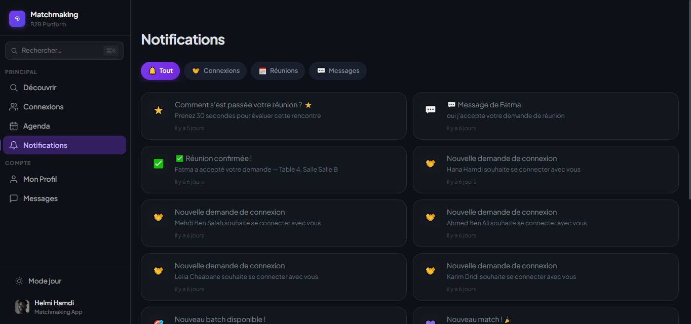
- Filtres : Tout · Connexions · Réunions · Messages
- Grille 2 colonnes
- Types : ⭐ Évaluation · ✅ Réunion confirmée · 🧡 Connexion · 💬 Message

---

### `notifications-mobile.png` — Notifications (mobile)
Centre de notifications adapté mobile — liste verticale, mode sombre.

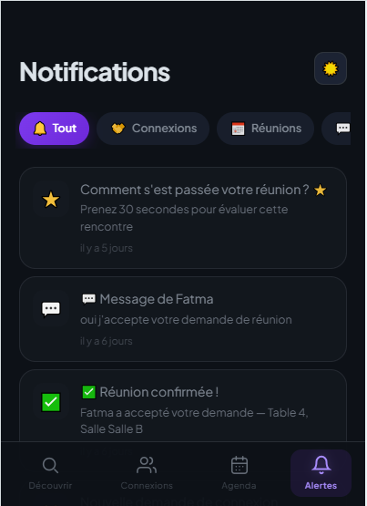

- Navigation bottom bar : Découvrir · Connexions · Agenda · Alertes
- Même contenu qu'en desktop, disposé en liste

---

## 🛠️ Stack technique

- **Temps réel** : WebSocket
- **Notifications** : Push + SMS + Email
- **IA** : GPT-4o pour génération des messages de demande de réunion
- **QR Scan** : Caméra native avec fallback manuel
- **Priorités** : High (5.1, 5.3) · Medium (5.2, 6.x, 7.x) · Low (5.4, 5.5)

---

*Basé sur les spécifications fonctionnelles — Modules 4, 5, 6 et 7*
